# 调试说明

### 环境准备

* IntelliJ IDEA
* JDK corretto-11.0.13

### 操作

1. 编辑当前目录下的 [breakpoint.xml](breakpoint.xml) 里 `component` 元素中所有的 `url` 元素值，把其替换你本地jdk对应的位置
2. 把当前目录下的 [breakpoint.xml](breakpoint.xml) 里的 `component` 元素与项目目录下的 `.idea` 目录里的 `workspace.xml` 中的 `component` 元素进行替换
3. 对 [程序](../src/main/java/org/fade/demo/streamdemo/pipeline/Main.java) 进行debug

### 结论

参考 [Stream Pipelines](https://github.com/CarpenterLee/JavaLambdaInternals/blob/master/6-Stream%20Pipelines.md)

##### 为什么需要流水线

目的是为了尽量减少迭代次数和避免存储中间结果

##### stream流水线要解决的问题

1. 如何记录用户的操作
2. 操作如何叠加
3. 叠加之后的操作如何执行
4. 执行后的结果（如果有）在哪里

##### 1. 如何记录用户的操作

首先明确一个概念，这里的用户操作指的是stream的中间操作：

<table width="600"><tr><td colspan="3" align="center"  border="0">Stream操作分类</td></tr><tr><td rowspan="2"  border="1">中间操作(Intermediate operations)</td><td>无状态(Stateless)</td><td>unordered() filter() map() mapToInt() mapToLong() mapToDouble() flatMap() flatMapToInt() flatMapToLong() flatMapToDouble() peek()</td></tr><tr><td>有状态(Stateful)</td><td>distinct() sorted() sorted() limit() skip() </td></tr><tr><td rowspan="2"  border="1">结束操作(Terminal operations)</td><td>非短路操作</td><td>forEach() forEachOrdered() toArray() reduce() collect() max() min() count()</td></tr><tr><td>短路操作(short-circuiting)</td><td>anyMatch() allMatch() noneMatch() findFirst() findAny()</td></tr></table>

> Stream上的所有操作分为两类：中间操作和结束操作，中间操作只是一种标记，只有结束操作才会触发实际计算。中间操作又可以分为无状态的(*Stateless*)和有状态的(*Stateful*)，无状态中间操作是指元素的处理不受前面元素的影响，而有状态的中间操作必须等到所有元素处理之后才知道最终结果，比如排序是有状态操作，在读取所有元素之前并不能确定排序结果；结束操作又可以分为短路操作和非短路操作，短路操作是指不用处理全部元素就可以返回结果，比如*找到第一个满足条件的元素*。之所以要进行如此精细地划分，是因为底层对每一种情况的处理方式不同。

stream与记录用户操作的类如下图所示(以 `ReferencePipeline` 为例)：

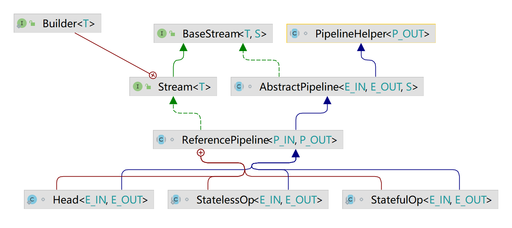

其中 `Head` 表示流刚产生后的阶段，比如容器调用 `.stream()` 方法时的阶段； `StatelsssOp` 对应无状态操作后的阶段； `StatefulOp` 对应有状态后的阶段。

现在我们开始对示例程序开始debug：

在下图所示地方打一个断点：

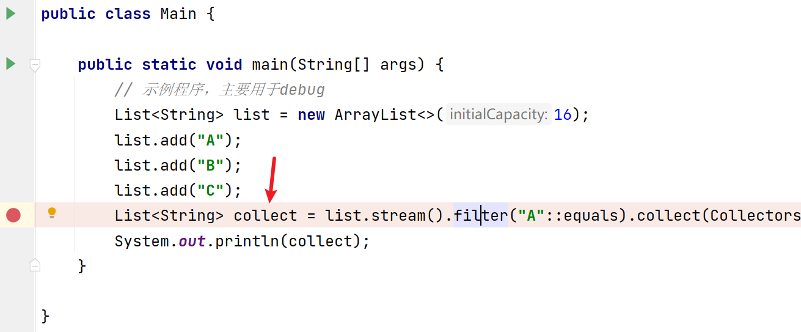

先进 `stream()` 方法里看一看：

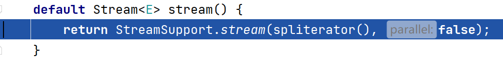

我们可以看到其调用了 `StreamSupport` 的 `stream` 方法，我们看下这个 `stream` 方法：


这里我们可以看到有一个比较重要的类 `Head` ，我们看下它的这个构造函数：

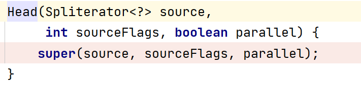

继续看它父类 `ReferencePipeline` 的构造函数：

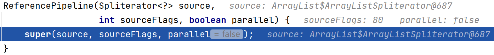

再看 `ReferencePipeline` 父类 `AbstractPipeline` 的构造函数：

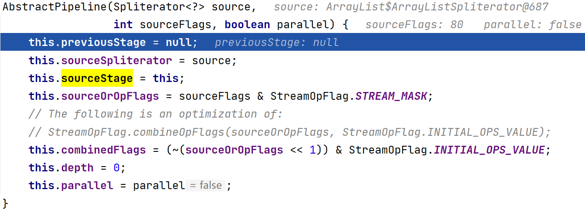

我们可以看到这里有很多属性，我们来看一下 `AbstractPipeline` 的这些属性：

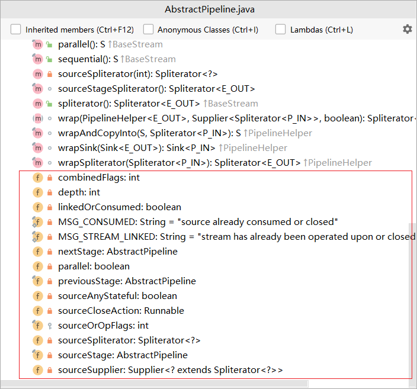

这里有三个参数 `nextStage` 、 `previousStage` 和 `sourceStage` ，它们的参数类型都是 `AbstractPipeline` ，结合一下它们的命名 ，我们大致可以猜出 `AbstractPipeline` 的数据结构大概是类似于双链表的结点，而整个stream的流水线就是一个双链表。 `ReferencePipeline` 类的内部类 `Head` 是表示头节点的这样一个类。

我们回到一开始的地方：


再看一下无状态的中间操作 `filter()` 方法：


这里比较重要的类是 `StatelessOp` ，它代表着无状态的中间操作后的阶段，我们看一下它的构造方法， `this` 即 `.stream()` 方法后的流：

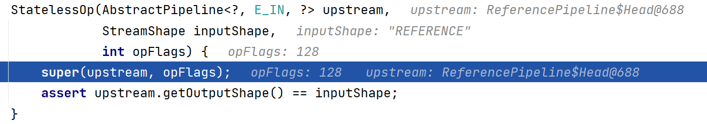

沿构造方法链深入到 `AbstractPipeline` :

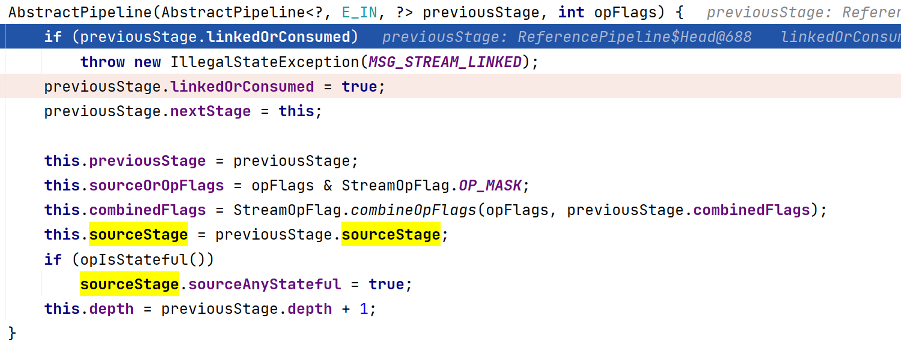

在这里我们可以看到，传进来的 `Head` 的 `nextStage` 被设置为了当前阶段（即 `filter()` 方法后的阶段），而当前阶段的 `previousStage` 和 `sourceStage` 被设置为了 `Head` ，这很明显就是双链表结点之间联系的建立过程。

所以stream流水线的组织结构示意图如下所示：

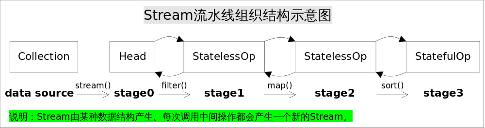

> 最后总结一下，stream的一系列中间操作（包括一开始产生流的操作）不断产生新的stream，这些Stream对象以双向链表的形式组织在一起，构成整个流水线，由于每个阶段都记录了前一个阶段和本次的操作以及回调函数，依靠这种结构就能建立起对数据源的所有操作。

##### 2. 操作如何叠加 、 3. 叠加之后的操作如何执行

操作为什么要叠加？不是从 `Head` 阶段开始依次执行每一个中间阶段的操作就行了吗？

上面的问题，答案是不行的。因为每个阶段是只知道自己本身的动作的，它并不知道后面的阶段执行的操作是什么以及回调函数是哪种形式。比如假设一个无状态的 `filter()` 方法后面跟着一个有状态的 `sorted()` 方法， `sorted()` 方法是要在所有处理元素处理后才能得出最终结果，这时为了尽量减少迭代数，有必要叠加stream的操作，并协调相邻阶段之间的调用关系。

这种相邻阶段之间的调用关系是通过 `Sink` 接口完成的：

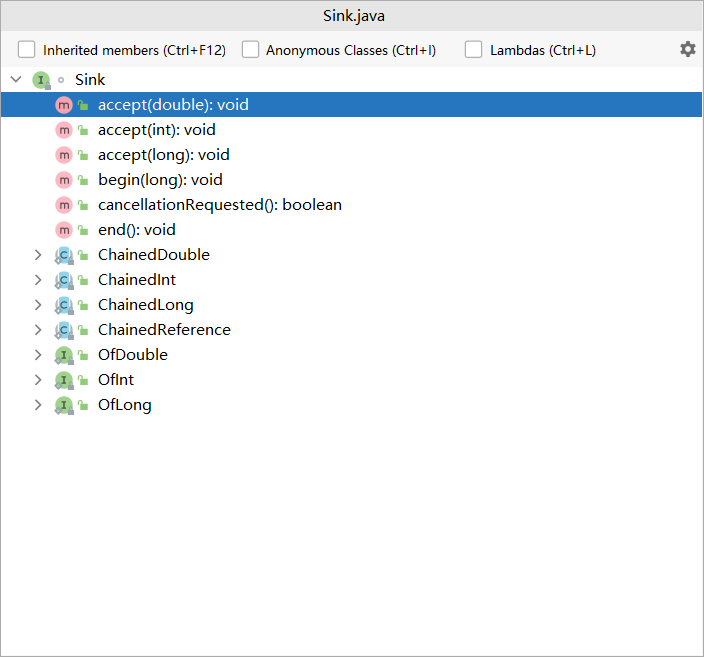

其中常用的几个方法是：

<table width="600px"><tr><td align="center">方法名</td><td align="center">作用</td></tr><tr><td>void begin(long size)</td><td>开始遍历元素之前调用该方法，通知Sink做好准备。</td></tr><tr><td>void end()</td><td>所有元素遍历完成之后调用，通知Sink没有更多的元素了。</td></tr><tr><td>boolean cancellationRequested()</td><td>是否可以结束操作，可以让短路操作尽早结束。</td></tr><tr><td>void accept(T t)</td><td>遍历元素时调用，接受一个待处理元素，并对元素进行处理。每个阶段把自己包含的操作和回调方法封装到该方法里，前一个阶段只需要调用当前阶段.accept(T t)方法就行了。</td></tr></table>

再来看一下前面的那个例子，这里为了完整的揭示操作如何叠加和操作如何执行的流程，我们将它复杂化了一些：

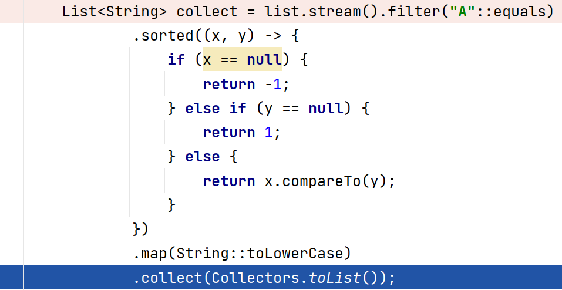

`collect()` 方法之前的中间操作无非是将stream的各个阶段建立联系，我们着重看一下 `collect()` 操作， `collect()` 是非短路结束操作：

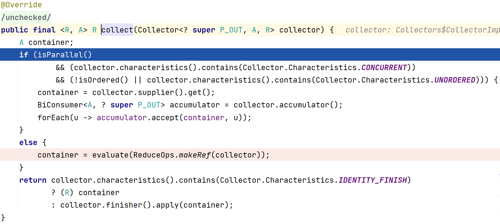

因为暂时不考虑并行，所以我们着重关注下 `evaluate(ReduceOps.makeRef(collector))` 。首先看一下 `ReduceOps.makeRef(collector)` :

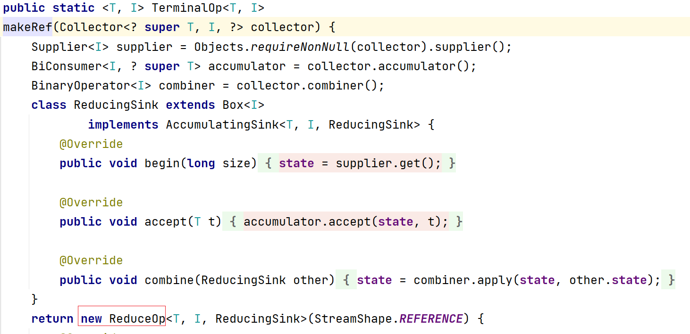

它创建表示结束操作的 `TerminalOp` ，接着我们来看 `evaluate()` 方法：

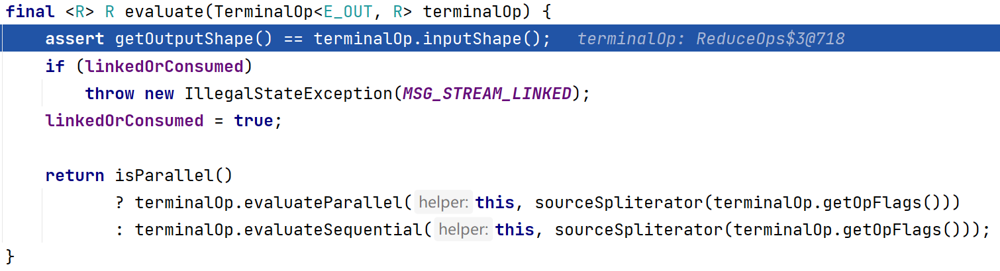

这里由于我们的示例不是并行的，于是我们继续查看 `evaluateSequential()` 方法：

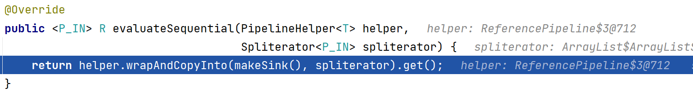

`makeSink()` 返回了一个 `Sink` 的实例，继续深入看 `wrapAndCopyInto()` 方法：

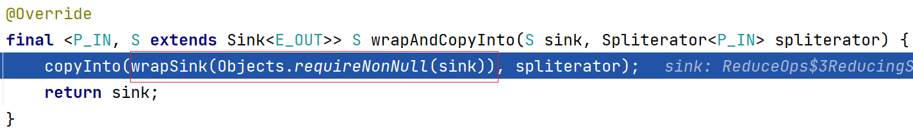

注意这个 `wrapSink()` 方法，这个方法会把流水线上从开始到结束的所有的操作都被包装到了一个 `Sink` 里，我们具体看一下它是怎么实现的：

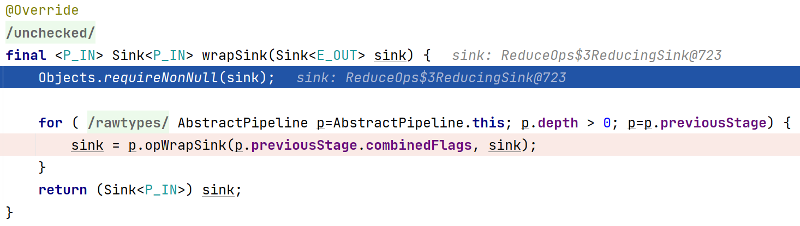

`AbstractPipeline.this` 其实就是我们执行 `map()` 方法后的阶段，这可以通过查看这个变量验证：

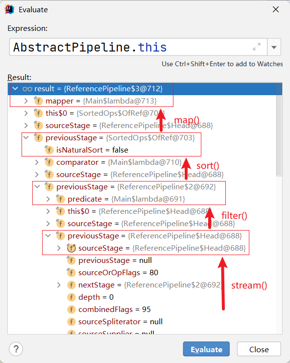

我们再看一下 `wrapSink()` 方法里的 `opWrapSink()` 方法，其实这个方法你肯定很眼熟，他在前面就已经出现过(下图当循环一直执行时会出现，这在例子的 `filter()` 方法执行时也出现过)：


通过查看代码，我们可以知道这个 `opWrapSink()` 方法其实就是把我们前面通过 `makeSink()` 方法生成的 `Sink` 和变成当前阶段的回调函数封装成一个新的 `Sink` 。如此不断将当前操作与下游 `Sink` （即 `Sink` 中的 `downstream` 参数）结合成新 `Sink` ，就实现了将流水线上从开始到结束的所有的操作都被包装到了一个Sink里。

现在我们再回去看 `wrapAndCopyInto()` 方法里调用的 `copyInto()` 方法：

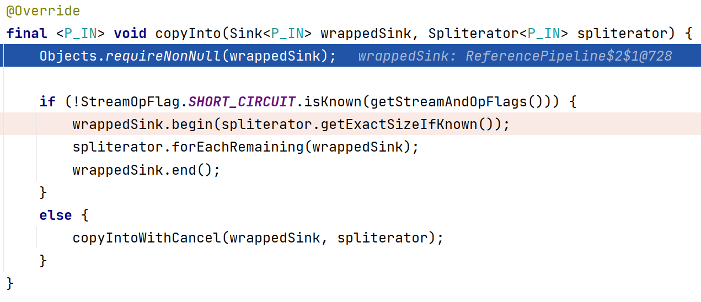

这里就很关键了，是与执行叠加之后的操作有关了，这里我们的示例选择的是非短路操作的 `collect()` 方法，所以执行进入了 `if` 代码块。我们先看一下 `wrappedSink` 的 `begin()` 方法：

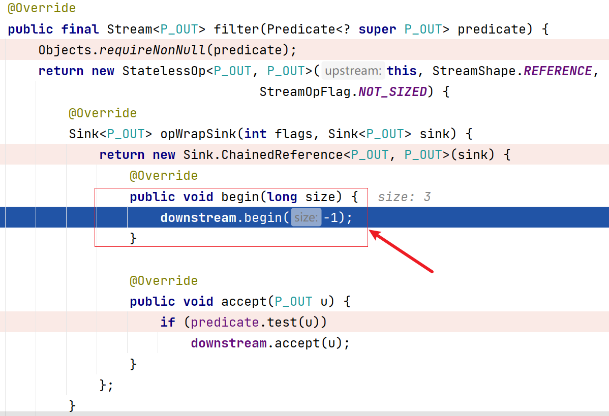

没错，又是你在前面见过的。 `wrappedSink.begin()` 会去执行 `filter()` 方法返回的阶段里实现的 `onWrapSink()` 里返回的 `Sink` 里的 `begin()` 方法。我们继续跟着调用下流的 `begin()` 方法：

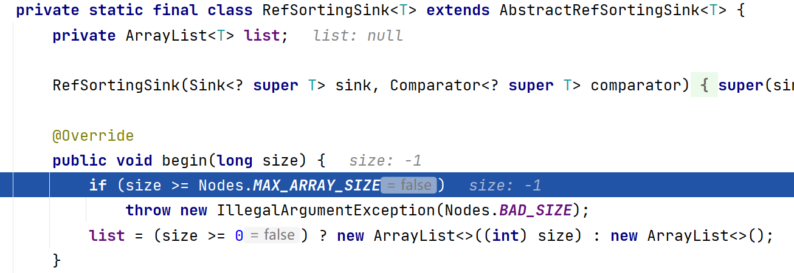

发现它调用了示例 `sort()` 方法返回的阶段实现的 `onWrapSink()` 里返回的 `Sink` 里的 `begin()` 方法，它创建了一个空的容器。

上面的 `begin()` 方法执行完回到了 `copyInto()` 方法，我们来看 `copyInto()` 方法调用的 `spliterator.forEachRemaining()` 方法：


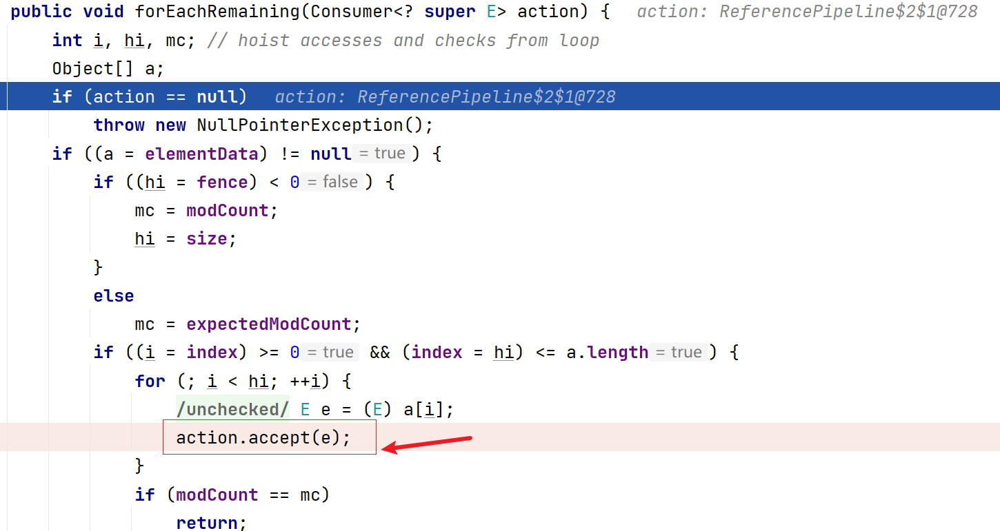

`forEachRemaining()` 有一个关键的地方 `action.accept()` ，这个 `action` 就是流水线上所有的操作被包装后的 `Sink` ，我们点进去看一下这个 `accept()` 方法：

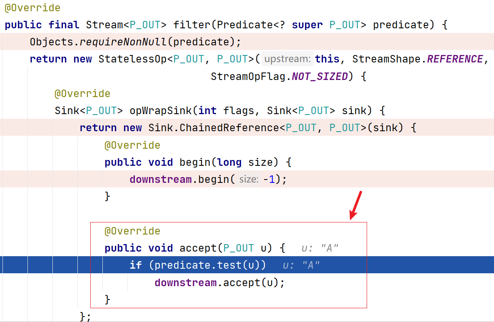

发生又是见过了的 —— `filter()` 方法返回的阶段里实现的 `onWrapSink()` 里返回的 `Sink` 里的 `accept()` 方法， `if` 条件里的 `predicate.test(u)` 就是调用我们在例子中的 `filter()` 方法里传入的lambda表达式 ，而它又会去调用它的下游 —— `sorted()` 方法返回的阶段实现的 `onWrapSink()` 里返回的 `Sink` 里的 `accept()` 方法：

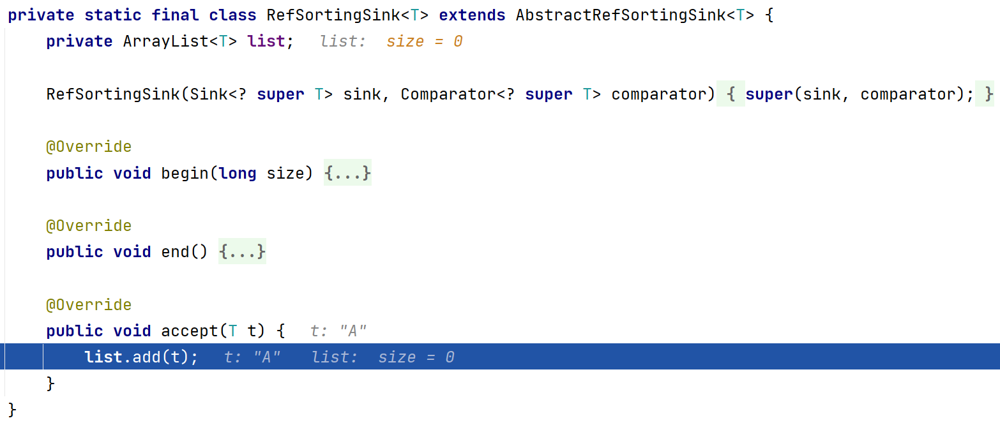

它把经过上游 `accept()` 方法处理的元素添加到前面 `begin()` 方法创建的容器里。

如此 `copyInto()` 方法里的 `spliterator.forEachRemaining()` 方法执行后，我们看一下 `wrappedSink.end()` 方法

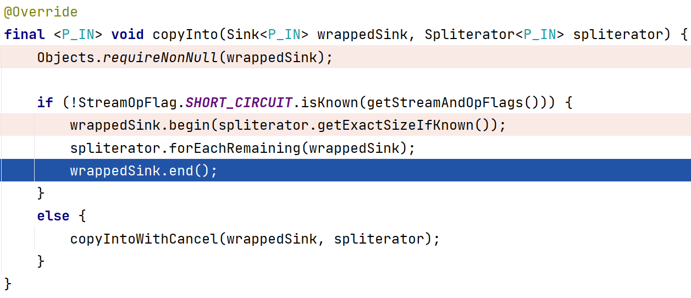

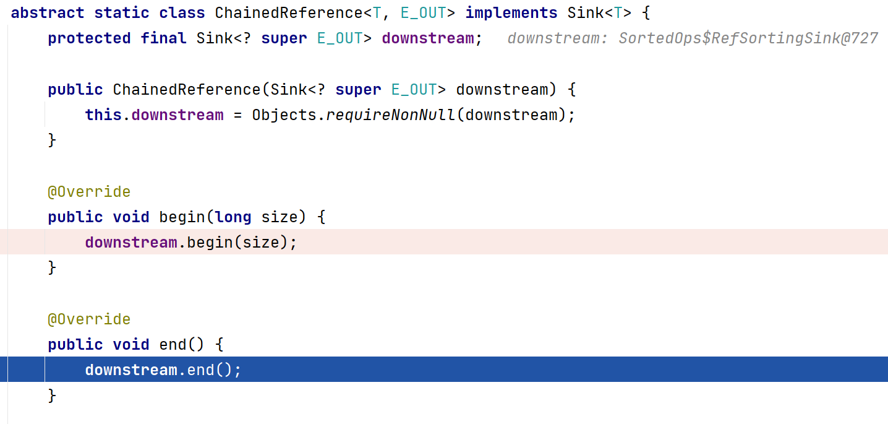

我们可以发现 `filter()` 方法返回的阶段里实现的 `onWrapSink()` 里返回的 `Sink` 里的 `end()` 方法会去调用下游 `sorted()` 方法返回的阶段里实现的 `onWrapSink()` 里返回的 `Sink` 里的 `end()` 方法：

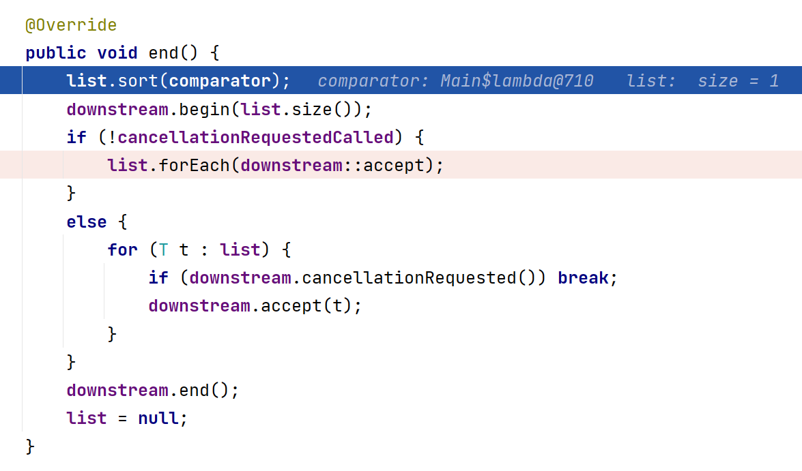

该 `Sink` 的 `end()` 方法会把前面迭代后的元素进行排序，再去调用下游的相关方法：

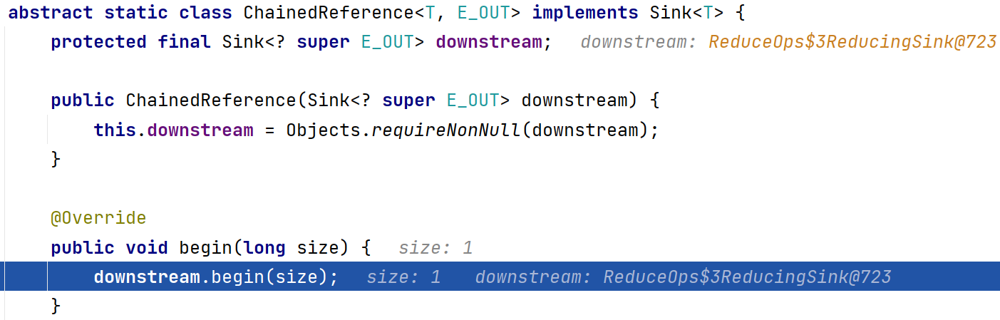

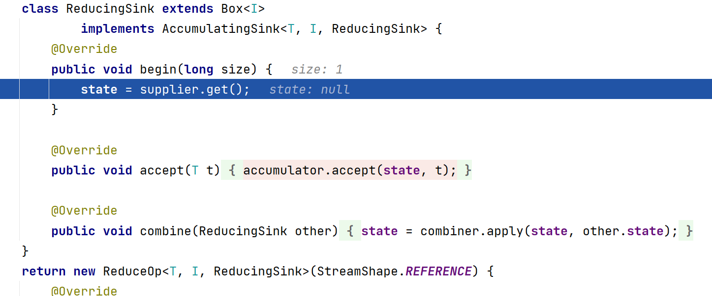

`sorted()` 方法返回的阶段里实现的 `onWrapSink()` 方法里返回的 `Sink` 里实现的 `end()` 方法调用的 `begin()` 方法很简单，就是调用它的下游 `map()` 方法返回的阶段里实现的 `onWrapSink()` 方法里返回的 `Sink` 的 `begin()` 方法，这个 `begin()` 方法又会去调用它的下游 `collect()` 方法产生的 `Sink` 里的 `begin()` 方法，而这个 `begin()` 方法仅是创建一个容器的作用（ 示例中我们调用的是 `collect(Collectors.toList())` ，它其实就等价于 `collect(ArrayList::new, ArrayList::add, ArrayList::addAll)` ，而 `ArrayList::new` 就是这个 `Supplier` ）。

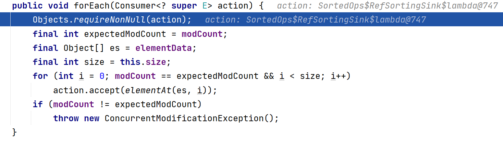

上图中 `for` 循环内的 `action` 即示例 `map()` 方法返回的阶段里实现的 `onWrapSink()` 方法里返回的 `Sink` 。

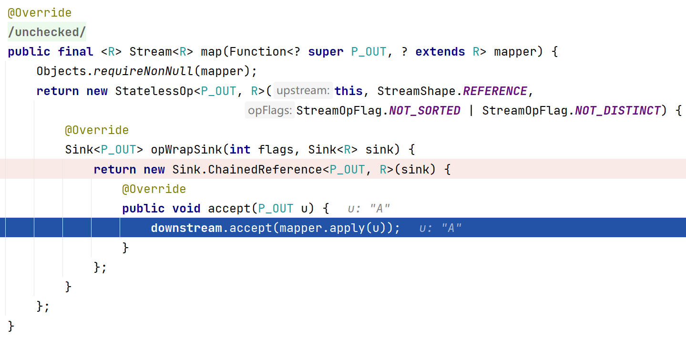

上图的 `mapper` 即为示例中我们传入的 `String::toLowerCase`

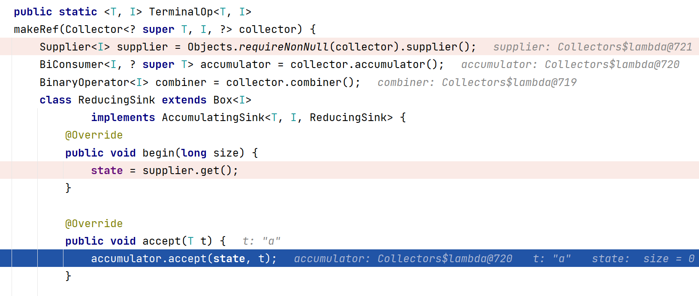

因为 `collect(Collectors.toList())` 等价于 `collect(ArrayList::new, ArrayList::add, ArrayList::addAll)` ，所以上图中的 `accumulator` 就是 `ArrayList::add` 的意思，就是把元素添加到容器中。

所以 `sorted()` 方法返回的阶段里实现的 `onWrapSink()` 方法里返回的 `Sink` 里实现的 `end()` 方法调用的 `forEach()` 方法也很简单，就是在循环内依次调用下游的 `accept()` 方法。

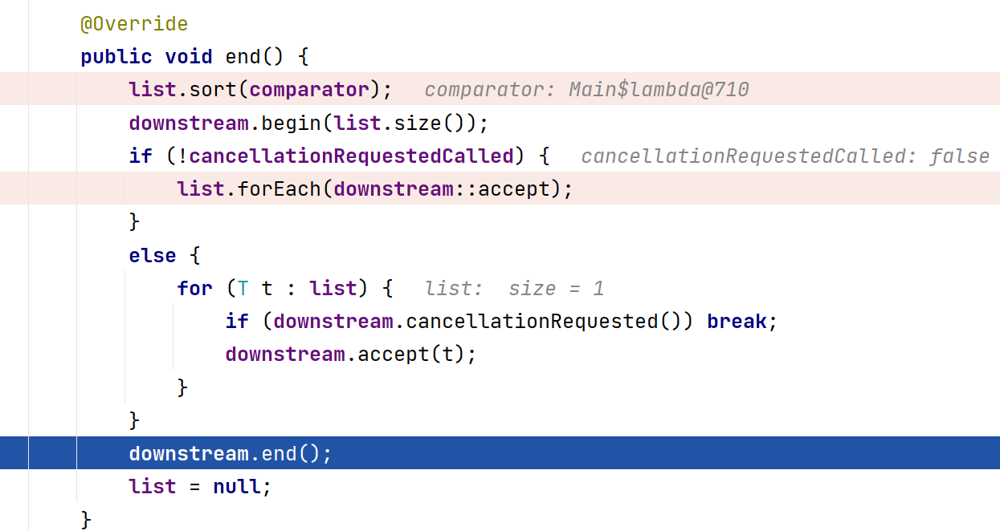

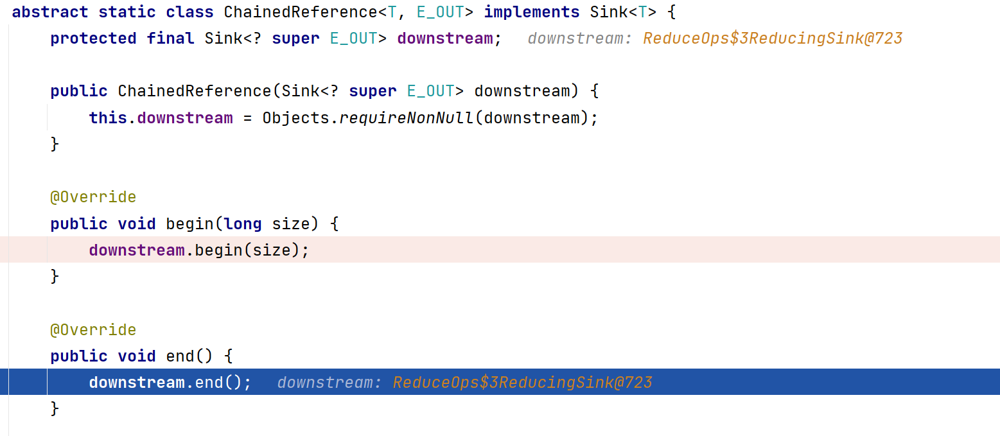

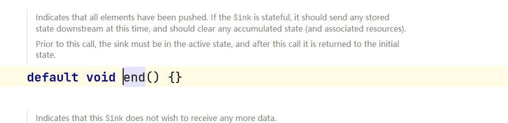

`sorted()` 方法返回的阶段里实现的 `onWrapSink()` 方法里返回的 `Sink` 里实现的 `end()` 方法调用的 `end()` 就更简单了，什么也不做。

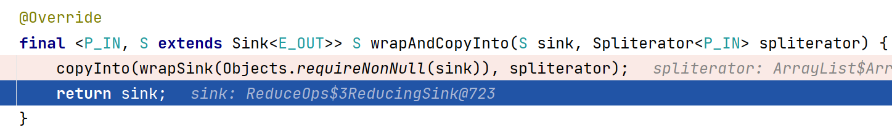


最后我们回去看一下 `evaluateSequential()` 方法，里面的 `wrapAndCopyInto()` 方法我们已经分析完了，我们看下 `get()` 方法：

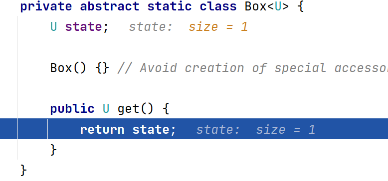

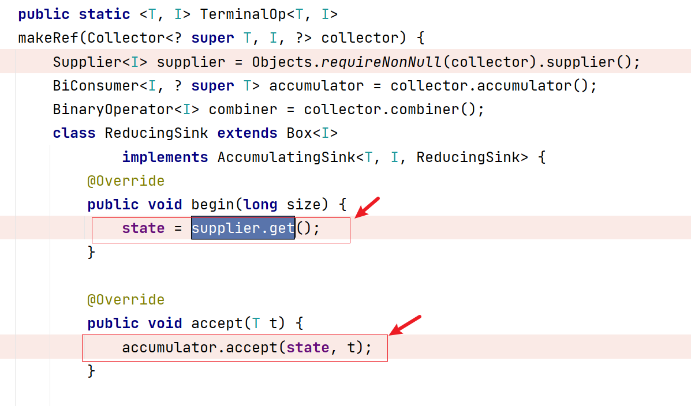

它返回了 `state` ，而 `state` 在调用 `collect()` 方法产生的 `Sink` 里实现的 `begin()` 和 `accept()` 方法时已经被操作过，所以 `state` 就是我们所需要的结果。

总结一下：

```java
List<String> collect = list.stream().filter("A"::equals)
                .sorted((x, y) -> {
                    if (x == null) {
                        return -1;
                    } else if (y == null) {
                        return 1;
                    } else {
                        return x.compareTo(y);
                    }
                })
                .map(String::toLowerCase)
                .collect(Collectors.toList());
```

例子中的 `sorted()` 方法是有状态的中间操作，在它前面的操作（包括它自己） 都是在一次迭代内完成的，也只存储了一次结果（在 `sorted() 方法`）。 `sorted()` 方法后面的操作（不包括它自己）也是在一次迭代内完成，只在 `collect()` 时存储了一次结果。

##### 4. 执行后的结果（如果有）在哪里

<table width="350px"><tr><td align="center">返回类型</td><td align="center">对应的结束操作</td></tr><tr><td>boolean</td><td>anyMatch() allMatch() noneMatch()</td></tr><tr><td>Optional</td><td>findFirst() findAny()</td></tr><tr><td>归约结果</td><td>reduce() collect()</td></tr><tr><td>数组</td><td>toArray()</td></tr></table>

##### 尚未理解/描述清楚的地方

* 代表结束操作的阶段 `TerminalOp` 是否有像中间操作一样以双链表的形式连接在一起，目前据我的理解是没有的，因为结束操作中调用的 `wrapSink()` 方法里的 `AbstractPipeline.this` 是可以查询出以往的所有操作的，所以 `TerminalOp` 就没有和中间阶段以双链表的形式链接起来。但是这样设计的目的优点是？：

