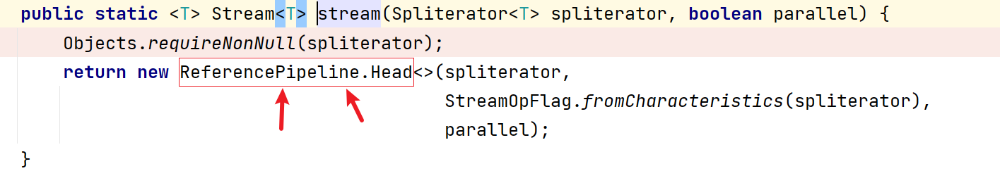

# 调试说明

### 环境准备

* IntelliJ IDEA
* JDK corretto-11.0.13

### 操作

1. 编辑当前目录下的 [breakpoint.xml](breakpoint.xml) 里 `component` 元素中所有的 `url` 元素值，把其替换你本地jdk对应的位置
2. 把当前目录下的 [breakpoint.xml](breakpoint.xml) 里的 `component` 元素与项目目录下的 `.idea` 目录里的 `workspace.xml` 中的 `component` 元素进行替换
3. 对 [程序](../src/main/java/org/fade/demo/streamdemo/pipeline/Main.java) 进行debug

### 结论

参考 [Stream Pipelines](https://github.com/CarpenterLee/JavaLambdaInternals/blob/master/6-Stream%20Pipelines.md)

##### 为什么需要流水线

目的是为了尽量减少迭代次数和避免存储中间结果

##### stream流水线要解决的问题

1. 如何记录用户的操作
2. 操作如何叠加
3. 叠加之后的操作如何执行
4. 执行后的结果（如果有）在哪里

##### 1. 如何记录用户的操作

首先明确一个概念，这里的用户操作指的是stream的中间操作：

<table width="600"><tr><td colspan="3" align="center"  border="0">Stream操作分类</td></tr><tr><td rowspan="2"  border="1">中间操作(Intermediate operations)</td><td>无状态(Stateless)</td><td>unordered() filter() map() mapToInt() mapToLong() mapToDouble() flatMap() flatMapToInt() flatMapToLong() flatMapToDouble() peek()</td></tr><tr><td>有状态(Stateful)</td><td>distinct() sorted() sorted() limit() skip() </td></tr><tr><td rowspan="2"  border="1">结束操作(Terminal operations)</td><td>非短路操作</td><td>forEach() forEachOrdered() toArray() reduce() collect() max() min() count()</td></tr><tr><td>短路操作(short-circuiting)</td><td>anyMatch() allMatch() noneMatch() findFirst() findAny()</td></tr></table>

> Stream上的所有操作分为两类：中间操作和结束操作，中间操作只是一种标记，只有结束操作才会触发实际计算。中间操作又可以分为无状态的(*Stateless*)和有状态的(*Stateful*)，无状态中间操作是指元素的处理不受前面元素的影响，而有状态的中间操作必须等到所有元素处理之后才知道最终结果，比如排序是有状态操作，在读取所有元素之前并不能确定排序结果；结束操作又可以分为短路操作和非短路操作，短路操作是指不用处理全部元素就可以返回结果，比如*找到第一个满足条件的元素*。之所以要进行如此精细地划分，是因为底层对每一种情况的处理方式不同。

stream与记录用户操作的类如下图所示(以 `ReferencePipeline` 为例)：

其中 `Head` 表示流刚产生后的阶段，比如容器调用 `.stream()` 方法时的阶段； `StatelsssOp` 对应无状态操作后的阶段； `StatefulOp` 对应有状态后的阶段。

现在我们开始对示例程序开始debug：

在下图所示地方打一个断点：

先进 `stream()` 方法里看一看：

我们可以看到其调用了 `StreamSupport` 的 `stream` 方法，我们看下这个 `stream` 方法：

这里我们可以看到有一个比较重要的类 `Head` ，我们看下它的这个构造函数：

继续看它父类 `ReferencePipeline` 的构造函数：

再看 `ReferencePipeline` 父类 `AbstractPipeline` 的构造函数：

我们可以看到这里有很多属性，我们来看一下 `AbstractPipeline` 的这些属性：

这里有三个参数 `nextStage` 、 `previousStage` 和 `sourceStage` ，它们的参数类型都是 `AbstractPipeline` ，结合一下它们的命名 ，我们大致可以猜出 `AbstractPipeline` 的数据结构大概是类似于双链表的结点，而整个stream的流水线就是一个双链表。 `ReferencePipeline` 类的内部类 `Head` 是表示头节点的这样一个类。

我们回到一开始的地方：

再看一下无状态的中间操作 `filter()` 方法：

这里比较重要的类是 `StatelessOp` ，它代表着无状态的中间操作后的阶段，我们看一下它的构造方法， `this` 即 `.stream()` 方法后的流：

沿构造方法链深入到 `AbstractPipeline` :

在这里我们可以看到，传进来的 `Head` 的 `nextStage` 被设置为了当前阶段（即 `filter()` 方法后的阶段），而当前阶段的 `previousStage` 和 `sourceStage` 被设置为了 `Head` ，这很明显就是双链表结点之间联系的建立过程。

所以stream流水线的组织结构示意图如下所示：

> 最后总结一下，stream的一系列中间操作（包括一开始产生流的操作）不断产生新的stream，这些Stream对象以双向链表的形式组织在一起，构成整个流水线，由于每个阶段都记录了前一个阶段和本次的操作以及回调函数，依靠这种结构就能建立起对数据源的所有操作。

##### 2. 操作如何叠加

